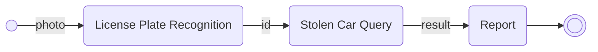
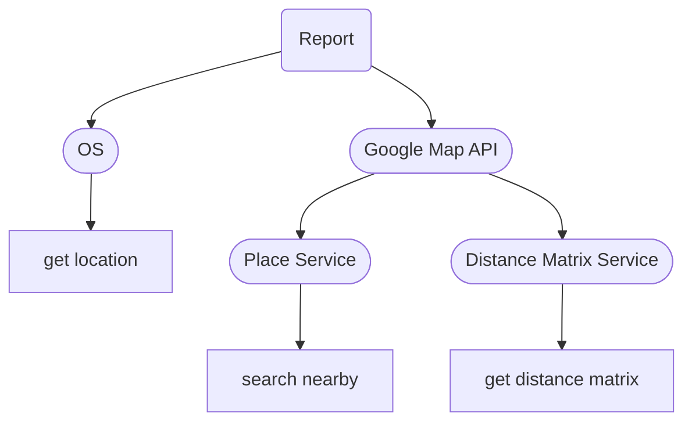

# license-plate-explorer

Recognize the license plate and check whether it's stolen. You can get the polices information to report if it is.

This project is deploy on github pages https://gnyar.github.io/license-plate-explorer/.

> Because of the security issue (mixed content) the recognition feature is not working, but it can run on local environment.

## Features

Done:

- Scanning Search
- Key-In Search
- Report

TODO:

- Edit location
- Photo Upload
- Check Photo

## Module process



### License Plate Recognition

Call API to get the ID string from photo. The implement is a Python program.

```sh
curl -X 'POST' \
  'API_ENDPOINT' \
  -H 'accept: application/json' \
  -H 'Content-Type: multipart/form-data' \
  -F 'file=@IMAGE.jpg;type=image/jpeg'
```

### Stolen Car Query

Code: `/src/utils.js` function `imgToTxt`

Imiate [API request](https://eze8.npa.gov.tw/NpaE8ServerRWD/CL_Query.jsp) of National Police Agency (Republic of China, Taiwan) to query if the vehicle is stolen. And transform the result to a specific format.

```js
// format 1: no data
{
  "id": "車牌",
  "isStolen": false,
}

// format 2: stolen vehicle
{
  "id": "車牌",
  "isStolen": true,
  "type": "汽車" | "重機車" | "輕機車" | "動力機械車"
}
```

### Report

Code: `/src/utils.js` function `queryStolenAPI`

Default to use device location to set the vehicle position. Search nearby police stations and sort by the distance to rapidly help the user report the vehicle.



## Project Setup

> **License Plate Recognition** module must change a API endpoint in `/src/utils.js` function `imgToTxt`.
>
> **Report** module need to set a environment variable `VITE_GOOGLE_API_KEY` in `.env` file.

```sh
npm install
```

### Compile and Hot-Reload for Development

```sh
npm run dev
```

### Compile and Minify for Production

```sh
npm run build
```

### Lint with [ESLint](https://eslint.org/)

```sh
npm run lint
```

### Test with [Vitest](https://vitest.dev/)

```sh
npm run test
```
